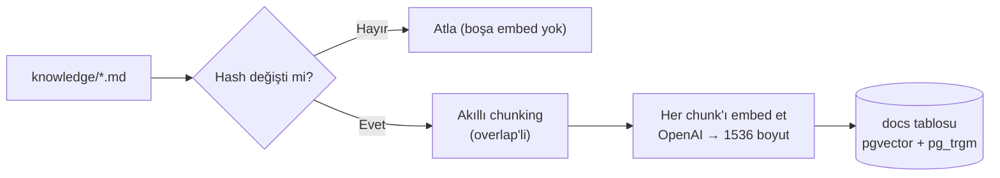
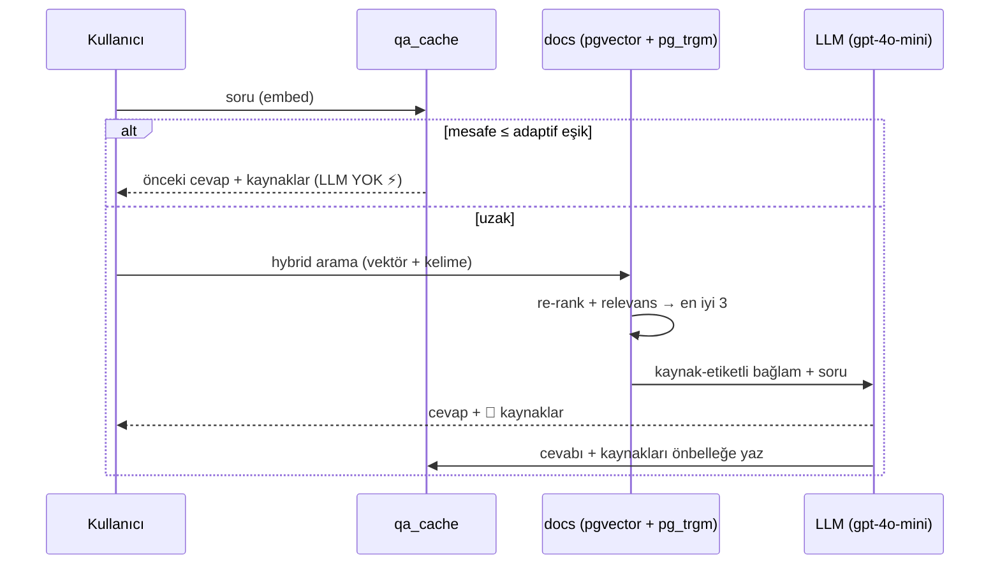
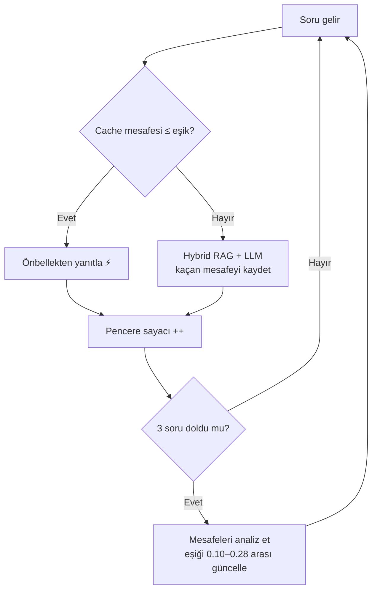

# 🧠 Minimal RAG — .NET + pgvector + OpenAI

> Bir akşamda uçtan uca çalıştırıp RAG'i **gerçekten** anlamak için yazılmış,
> sade ama "gösterilebilir" bir öğrenme projesi. Teoriyi okumak yerine; chunk'la,
> embed et, sakla, **hybrid ara**, üret — ve her adımı çalışırken gör.

```
Akış:  WATCH(klasör) → CHUNK → EMBED → STORE
       → ( SEMANTIC CACHE? ) → HYBRID RETRIEVE → RE-RANK → GENERATE
```

---

## 🎯 Bu proje ne işe yarar?

**RAG (Retrieval-Augmented Generation)**, bir dil modeline "kendi belgelerinden
cevap ver, bilmediğini uydurma" dedirtmenin yoludur. Belgelerini bir vektör
veritabanına koyarsın; soru gelince önce ilgili kısmı bulur, sonra ona dayanarak
cevaplar — ve **kaynağını gösterir**.

Bu repo, o döngüyü **en sade haliyle, ama gerçek bir veritabanı (pgvector) ve gerçek
bir model (OpenAI) ile** kuruyor. Framework sihirbazlığı yok; her satır görünür.
Amaç: RAG'i "kullanmak" değil, **anlamak**.

---

## 🏢 Kurgu: "Nexora" nedir?

Örnek veri, **kurgusal bir teknoloji şirketinin (Nexora) İK asistanı** senaryosudur.
`knowledge/` klasöründe maaş skalaları, yan haklar, izin politikaları, şirket
kültürü ve proje teknolojileri gibi ~37 bilgi parçası var. Hepsi **uydurma** —
amaç soru-cevap için zengin bir bilgi tabanı sağlamak. "Şirketin CEO'su kim?" diye
sorduğunda — bilgi tabanında yok — **"Bu bilgiye sahip değilim"** demesi, RAG'in
çalıştığının en net kanıtıdır. Kendi PDF/dökümanlarını `knowledge/`'a koyup bu
kurguyu istediğin alana taşıyabilirsin.

---

## ✨ Özellikler

| Özellik | Ne yapar |
|---|---|
| 🔍 **Klasik RAG** | Soruyu embed et → en yakın parçaları çek → bağlamla cevap üret, uydurma |
| 🔀 **Hybrid retrieval** | Vektör (`<=>`) **+** kelime benzerliği (`pg_trgm`) birleşik arama — typo'ları da yakalar |
| 🎚️ **Re-ranking** | Adayları kombine skorla (`0.7·semantik + 0.3·kelime`) yeniden sırala |
| 🛡️ **Relevans filtresi** | Çok uzak (alakasız) parçaları bağlama koyma |
| 📎 **Citations** | Her cevabın altında hangi dosyalardan geldiği |
| ⚡ **Semantic cache** | Benzer soru tekrar gelirse LLM'e **hiç gitmeden** önceki cevabı döndür |
| ♻️ **Artımlı indexleme** | `knowledge/`'da yalnızca **değişen** dosyaları yeniden vektörle (içerik hash'i) |
| 🎯 **Adaptif eşik** | Cache eşiğini, sorulan soruların mesafe analizine göre **kendisi ayarlar** |
| 🧹 **Otomatik cache temizleme** | Bir döküman değişince önbellek temizlenir → bayat cevap yok |
| 🔌 **Sağlayıcı bağımsızlığı** | LLM erişimi `Microsoft.Extensions.AI` (`IChatClient`) arkasında — OpenAI/Azure/Ollama tek satırda değişir |
| 🚀 **HNSW + trigram index** | Vektör ve kelime aramaları binlerce kayıtta da hızlı kalır |

---

## 🏗️ Mimari

```
  knowledge/*.md ──(SHA-256 hash değişti mi?)──► docs (source, VECTOR 1536, hash)
       │  değişen: DELETE + re-EMBED + INSERT             ▲
       │  değişmeyen: atla (boşa embed yok)               │ hybrid:  <=> (vektör)
       ▼                                                  │        + similarity (kelime)
  soru ─► embed(soru) ─┐                                  │
                       │   ┌──────────────────────────┐   │
                       ├──►│ qa_cache yakın mı? ≤ eşik │   │
                       │   └─────────────┬────────────┘   │
                 EVET ◄──────────────────┤                │
        (cache'ten + 📎 kaynaklar)       │ HAYIR          │
                                         ▼                │
                              HYBRID RETRIEVE ────────────┘
                                         │
                                         ▼
                          RE-RANK + relevans filtresi → top-3
                                         │
                                         ▼
                    augment (kaynak etiketli) + GENERATE (gpt-4o-mini)
                                         │
                                         ▼
                       cevap + 📎 kaynaklar + qa_cache'e yaz
                                         │
                        her 3 soruda bir ▼
                          eşiği yeniden hesapla (adaptif)
```

`<=>` cosine, `<->` L2, `<#>` inner product — pgvector operatörleri.

---

## ⚙️ Nasıl çalışır? (adım adım)

### 1️⃣ İndexleme — dökümanları "aranabilir" hale getir



### 2️⃣ Soru-cevap — önce önbellek, sonra hybrid arama, en son LLM



### 3️⃣ Adaptif eşik — sistem kendini ayarlar



---

## 🗂️ Proje yapısı

İş mantığı `Program.cs`'ten çıkarılıp katmanlı bir yapıya bölündü (`Program.cs`
artık sadece *composition root* + REPL):

```
Program.cs                    → servisleri kur + soru-cevap döngüsü
knowledge/                    → bilgi tabanı (her .md bir konu)
src/
 ├─ RagOptions.cs             → tüm ayarlar/sabitler tek yerde
 ├─ EnvLoader.cs · Hashing.cs · Models.cs
 ├─ EmbeddingService.cs       → embedding (MEAI IEmbeddingGenerator)
 ├─ ChatService.cs            → chat (MEAI IChatClient)
 ├─ Database.cs               → NpgsqlDataSource + şema (vector, pg_trgm, HNSW index)
 ├─ DocumentStore.cs          → docs: indexleme + hybrid aday getirme
 ├─ CacheStore.cs             → qa_cache: lookup / save / clear
 ├─ Chunker.cs                → akıllı chunking (overlap'li)
 ├─ Indexer.cs                → artımlı indexleme
 ├─ HybridRetriever.cs        → re-rank + relevans filtresi
 ├─ AdaptiveThreshold.cs      → kendini ayarlayan eşik
 └─ RagPipeline.cs            → tüm akışı orkestra eder
```

| Kavram | Dosya |
|---|---|
| Hybrid retrieval | `DocumentStore.RetrieveCandidatesAsync` (vektör `UNION` `pg_trgm`) |
| Re-rank + relevans | `HybridRetriever` |
| Semantic cache | `CacheStore` + `RagPipeline` |
| Adaptif eşik | `AdaptiveThreshold` |
| Artımlı indexleme | `Indexer` + `Hashing` |
| Chunking | `Chunker` |

---

## ⚙️ Gereksinimler
- **.NET 10 SDK** (proje `net10.0` hedefler — .NET 9 için `RagMini.csproj`'da `net9.0` yap)
- Docker (pgvector için)
- OpenAI API key (platform.openai.com)

---

## 🚀 Kurulum

```bash
# 1) pgvector'lü PostgreSQL
docker run -d --name ragdb -p 5432:5432 -e POSTGRES_PASSWORD=postgres pgvector/pgvector:pg16

# 2) API anahtarı (.env dosyası — repoya gitmez)
echo 'OPENAI_API_KEY=sk-...' > .env

# 3) Çalıştır
dotnet run
```

> `pg_trgm` ve `vector` extension'ları uygulama tarafından otomatik kurulur.

---

## 🧪 Dene

```
? senior maaşı nedir?
>> Cevap: Senior yazılım mühendisi aylık brüt 90.000-140.000 TL.
   (kaynak: LLM + 3 parça)
   📎 Kaynaklar: 02-maaslar.md

? senior olarak ne kadar alırım?          ← benzer soru, biraz sonra
>> Cevap: ... 90.000-140.000 TL ...
   (kaynak: ÖNBELLEK — LLM'e gidilmedi, mesafe=0.174, eşik=0.190)
   📎 Kaynaklar: 02-maaslar.md

? Şirketin CEO'su kim?                      ← bağlam dışı
>> Cevap: Bu bilgiye sahip değilim.
```

**Bir dosyayı düzenle** → tekrar çalıştır: sadece o dosya yenilenir, önbellek temizlenir.

---

## 📈 Yol haritası

**Tamamlandı** ✅
- [x] Klasik RAG · Semantic cache · Artımlı indexleme · Adaptif eşik · Otomatik cache temizleme
- [x] Citations · Akıllı chunking · Relevans filtresi · Hybrid search · Re-ranking
- [x] **HNSW + trigram index** (ölçek)
- [x] **`Microsoft.Extensions.AI` / `IChatClient`** (sağlayıcı bağımsızlığı)

**Sırada**
- [ ] Streaming yanıt
- [ ] PDF/Word ingestion
- [ ] Web API + minimal UI
- [ ] Eval harness (doğruluk/uydurma ölçümü)
- [ ] Observability (token, cache hit, gecikme)

---

## 📝 Notlar
- `RagOptions.cs`'teki eşikler (`MaxDistance`, `Vector/LexicalWeight`, `ThresholdCap`)
  deneyseldir; kendi verine göre ayarla.
- Adaptif eşik denetimsizdir: mükemmel olamaz ama mesafe dağılımıyla akıllıca yaklaşır.
- Embedding boyutu `text-embedding-3-small` için 1536; modeli değiştirirsen
  `RagOptions.EmbeddingDimensions`'ı da güncelle.
- Sıfırdan kurmak için: `docker exec ragdb psql -U postgres -d postgres -c "DROP TABLE IF EXISTS docs, qa_cache;"`

---

## 🛠️ Teknolojiler
.NET 10 · PostgreSQL + pgvector + pg_trgm (HNSW) · Microsoft.Extensions.AI · OpenAI (`text-embedding-3-small`, `gpt-4o-mini`) · Npgsql · Docker

> Bu bir öğrenme projesidir; üretim için değil, **anlamak** için yazıldı. Fork'la,
> kendi verini koy, yeni özellikler ekle. 🚀
