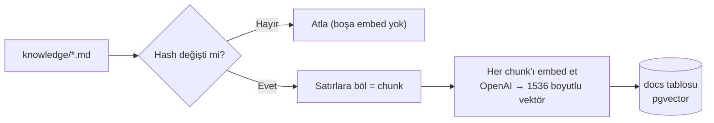
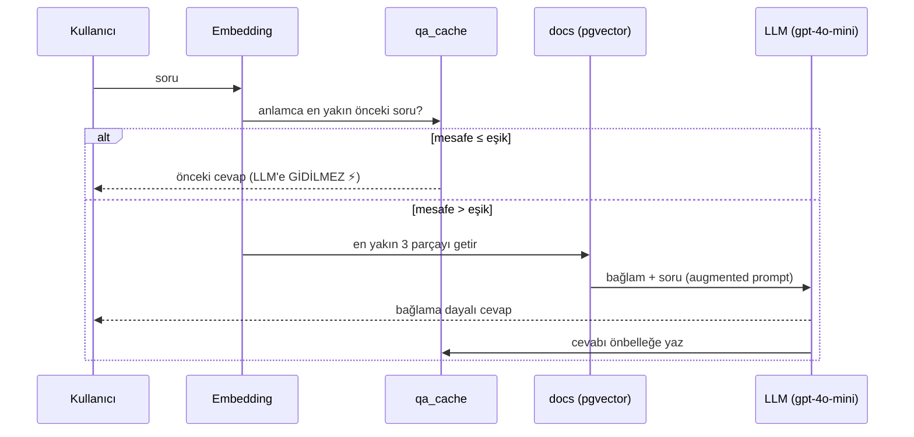
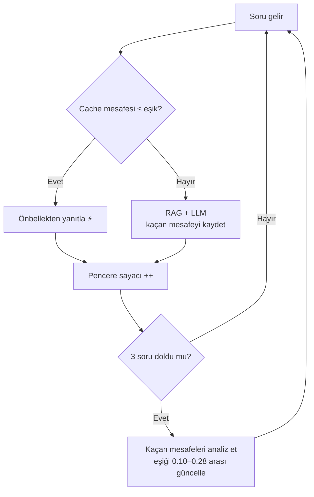

# 🧠 Minimal RAG — .NET + pgvector + OpenAI

> Bir akşamda uçtan uca çalıştırıp RAG'i **gerçekten** anlamak için yazılmış,
> sade ama "gösterilebilir" bir öğrenme projesi. Teoriyi okumak yerine; chunk'la,
> embed et, sakla, ara, üret — ve her adımı çalışırken gör.

```
Akış:  WATCH(klasör) → CHUNK → EMBED → STORE
       → ( SEMANTIC CACHE? ) → RETRIEVE → GENERATE
```

---

## 🎯 Bu proje ne işe yarar?

**RAG (Retrieval-Augmented Generation)**, bir dil modeline "kendi belgelerinden
cevap ver, bilmediğini uydurma" dedirtmenin yoludur. ChatGPT'ye şirketinin İK
politikalarını sorarsan uydurabilir; ama belgelerini bir vektör veritabanına koyup
"önce ilgili kısmı bul, sonra ona dayanarak cevapla" dersen — işte o **RAG**'dir.

Bu repo, o döngüyü **en sade haliyle, ama gerçek bir veritabanı (pgvector) ve gerçek
bir model (OpenAI) ile** kuruyor. Framework sihirbazlığı yok; her satır görünür.
Amaç: RAG'i "kullanmak" değil, **anlamak**.

Öğreneceklerin:
- **Embedding** nedir, metin neden 1536 boyutlu bir vektöre dönüşür
- **Vektör arama** (cosine distance) ile "anlamca en yakın" nasıl bulunur
- **Augmented prompt** ile modelin neden uydurmadığı
- Üstüne: önbellekleme, artımlı indexleme ve kendini ayarlayan eşik gibi
  **gerçek-dünya** problemleri

---

## 🏢 Kurgu: "Nexora" nedir?

Örnek veri, **kurgusal bir teknoloji şirketinin (Nexora) İK asistanı** senaryosudur.
`knowledge/` klasöründe maaş skalaları, yan haklar, izin politikaları, şirket
kültürü ve proje teknolojileri gibi ~37 bilgi parçası var. Hepsi **uydurma** —
amaç bir şirketi tanıtmak değil, **soru-cevap için zengin ve çeşitli bir bilgi
tabanı** sağlamak.

Neden İK? Çünkü herkesin sezgisi var ("yıllık izin kaç gün?", "uzaktan çalışabilir
miyim?") ve **bağlamda olan/olmayan** soruları ayırmak kolay. Asistana "şirketin
CEO'su kim?" diye sorduğunda — bilgi tabanında yok — **"Bu bilgiye sahip değilim"**
demesi, RAG'in çalıştığının en net kanıtıdır. Kendi PDF'lerini, wiki'ni veya
dökümanlarını `knowledge/`'a koyarak bu kurguyu istediğin alana taşıyabilirsin.

---

## ✨ Özellikler

| Özellik | Ne yapar |
|---|---|
| 🔍 **Klasik RAG** | Soruyu embed et → en yakın 3 parçayı çek → bağlamla cevap üret, uydurma |
| ⚡ **Semantic cache** | Benzer soru tekrar gelirse LLM'e **hiç gitmeden** önceki cevabı döndür |
| ♻️ **Artımlı indexleme** | `knowledge/`'da yalnızca **değişen** dosyaları yeniden vektörle (hash karşılaştırması) |
| 🎯 **Adaptif eşik** | Cache eşiğini, sorulan soruların mesafe analizine göre **kendisi ayarlar** |
| 🛡️ **Otomatik cache temizleme** | Bir döküman değişince ilgili önbellek temizlenir → bayat cevap yok |

---

## 🏗️ Mimari

```
  knowledge/*.md ──(SHA-256 hash değişti mi?)──► docs (VECTOR 1536)
       │  değişen dosya: DELETE + re-EMBED + INSERT      ▲
       │  değişmeyen   : atla (boşa embed yok)           │ cosine <=>
       ▼                                                 │
  soru ─► embed(soru) ─┐                                 │
                       │   ┌──────────────────────────┐  │
                       ├──►│ qa_cache yakın mı? ≤ eşik │  │
                       │   └─────────────┬────────────┘  │
                 EVET ◄──────────────────┤               │
        (LLM'siz, cache'ten)             │ HAYIR         │
                                         ▼               │
                                  retrieve(top-3) ───────┘
                                         │
                                         ▼
                          augment + GENERATE (gpt-4o-mini)
                                         │
                                         ▼
                              cevap + qa_cache'e yaz
                                         │
                        her 3 soruda bir ▼
                          eşiği yeniden hesapla (adaptif)
```

| Kavram | Kodda yeri (`Program.cs`) |
|---|---|
| **Chunking** | `knowledge/*.md` — boş olmayan her satır bir parça |
| **Artımlı indexleme** | `content_hash` karşılaştırması → değişen dosyada `DELETE`+`INSERT` |
| **Embedding** | `EmbedAsync` → 1536 boyutlu vektör (`text-embedding-3-small`) |
| **Vector store** | `docs` tablosu, `VECTOR(1536)` |
| **Semantic search** | `ORDER BY embedding <=> $1` — cosine distance |
| **Semantic cache** | `qa_cache` tablosu + dinamik `threshold` |
| **Adaptif eşik** | `winMissDist` analizi → `threshold` her `REVISE_EVERY` soruda güncellenir |
| **Augmented prompt** | bağlamı soruyla birleştiren `prompt` |
| **Generation** | `chat.CompleteChatAsync` (`gpt-4o-mini`) |

`<=>` cosine, `<->` L2, `<#>` inner product — pgvector operatörleri.

---

## ⚙️ Nasıl çalışır? (adım adım)

RAG iki fazdan oluşur: **(1) İndexleme** (bir kez, ya da döküman değişince) ve
**(2) Soru-cevap** (her soruda).

### 1️⃣ İndexleme — dökümanları "aranabilir" hale getir



Metin, sayılardan oluşan bir vektöre çevrilir. **Benzer anlam → benzer vektör.**

```
"yıllık izin 14 gündür"    → [ 0.21, -0.05, 0.88, ... ]   ┐ birbirine
"kaç gün tatil hakkım var" → [ 0.19, -0.03, 0.85, ... ]   ┘ ÇOK yakın
"ofis kafeterya menüsü"    → [-0.40,  0.77, 0.02, ... ]   ← uzak

Yakınlık = cosine distance (<=>).  0 = aynı anlam,  büyüdükçe = alakasız.
```

### 2️⃣ Soru-cevap — önce önbellek, sonra arama, en son LLM



### 3️⃣ Adaptif eşik — sistem kendini nasıl ayarlar?



> Özetle: **uydurmaz** (bağlama bağlı), **tekrarı boşa harcamaz** (cache),
> **boşa embed etmez** (artımlı index) ve **eşiği elle ayarlatmaz** (adaptif).

---

## 💸 Neden bu ekstra özellikler?

**Saf RAG**'de her soru iki OpenAI çağrısı yapar (embedding + chat) ve her açılış tüm
dökümanları yeniden embed eder. Asıl maliyet ve gecikme **LLM** tarafındadır.

- **Semantic cache:** "Yıllık iznim kaç gün?" ile "Kaç gün izin hakkım var?" farklı
  kelimeler ama aynı anlam → ikincisi LLM'e gitmeden cache'ten gelir.
- **Artımlı indexleme:** Sadece düzenlediğin dosya yeniden vektörlenir; gerisi atlanır.
- **Adaptif eşik:** Cache eşiğini elle ayarlamak zor — düşükse tasarruf az, yüksekse
  `senior`/`junior` gibi yakın sorular karışır. Sistem, son soruların mesafe
  dağılımına bakıp eşiği güvenli bir bantta (`0.10–0.28`) kendisi optimize eder.

---

## ⚙️ Gereksinimler
- **.NET 10 SDK** (proje `net10.0` hedefler — .NET 9 için `RagMini.csproj`'da `TargetFramework`'ü `net9.0` yap)
- Docker (pgvector için)
- OpenAI API key (platform.openai.com)

---

## 🚀 Kurulum

### 1. pgvector'lü PostgreSQL'i ayağa kaldır
```bash
docker run -d --name ragdb -p 5432:5432 -e POSTGRES_PASSWORD=postgres pgvector/pgvector:pg16
```

### 2. API anahtarını `.env`'e koy
Proje kökünde bir `.env` dosyası oluştur (repoya **gitmez**, `.gitignore`'dadır):
```
OPENAI_API_KEY=sk-...
```

### 3. Çalıştır
```bash
dotnet run
```

---

## 🧪 Dene

**İlk açılış** — tüm dökümanlar yeni:
```
>> İndexleme bitti. yeni=9, güncel=0, atlanan=0, silinen=0
```

**Bir dosyayı düzenle** → tekrar çalıştır (sadece o dosya yenilenir):
```
   ~ güncellendi: 02-maaslar.md (6 parça)
>> Dökümanlar değişti; önbellek temizlendi (3 kayıt).
```

**Soru-cevap** — bağlamda olan doğru, olmayan uydurulmaz, benzer olan cache'lenir:
```
? 5 yıldır çalışıyorum, kaç gün iznim var?
>> Cevap: 5-15 yıl arası kıdemde yıllık izin 20 gündür.
   (kaynak: LLM + 3 parça — önbelleğe eklendi)

? Kaç günlük yıllık iznim var, 5 senedir buradayım?
>> Cevap: 5-15 yıl arası kıdemde yıllık izin 20 gündür.
   (kaynak: ÖNBELLEK — LLM'e gidilmedi, mesafe=0.082, eşik=0.200)

? Şirketin CEO'su kim?
>> Cevap: Bu bilgiye sahip değilim.
```

**Her 3 soruda bir** eşik kendini ayarlar:
```
── 📊 Adaptif eşik analizi (son 3 soru) ──
   önbellekten yanıtlanan : 1/3
   LLM'e giden            : 2
   kaçanların mesafesi    : ort 0.214, en yakın 0.180
   eşik                   : 0.200 → 0.215  (sınırlar 0.10..0.28)
───────────────────────────────────────────
```

---

## 🗂️ Proje yapısı
```
Program.cs          → pipeline (artımlı index + cache + adaptif eşik + retrieve + generate)
knowledge/          → bilgi tabanı (her .md bir konu, her satır bir chunk)
RagMini.csproj      → bağımlılıklar + knowledge/ kopyalama kuralı
.gitignore          → bin/obj, .env ve sır sızıntısı koruması
```

---

## 💡 Geliştirme felsefesi — fikirden özelliğe

Bu proje sabit bir "örnek" değil; **her özellik bir soruyla doğdu.** İşler zaten
fikirlerden çıkar:

- *"Her şeye AI gitmesin, paramız yetmez"* → **semantic cache**
- *"Döküman değişince hepsini değil, sadece değişeni yenilesek?"* → **artımlı indexleme**
- *"Kullanan bayat cevaba düşmesin"* → **otomatik cache temizleme**
- *"Eşiği elle ayarlamak zor, kendisi öğrensin"* → **adaptif eşik**

Bir konuyu bilmeden de doğru soruyu sormak, çoğu zaman çözümün yarısıdır. Sen de
`knowledge/`'a kendi verini koyup yeni bir soru sor — bir sonraki özellik oradan çıkar.

---

## 📈 Sonraki adımlar (öğrendikçe ekle)

- [x] **Veriyi koddan ayır** — `knowledge/` klasörü
- [x] **Artımlı indexleme** — yalnızca değişen dökümanları yeniden vektörle
- [x] **Semantic cache** — benzer soruları LLM'e göndermeden yanıtla
- [x] **Otomatik cache invalidation** — veri değişince önbelleği temizle
- [x] **Adaptif eşik** — cache eşiğini veriye göre otomatik ayarla
- [ ] **PDF/Word desteği**: dosyaları metne çevirip ~500 kelimelik chunk'lara böl (overlap)
- [ ] **HNSW index**: çok kayıtta `USING hnsw (embedding vector_cosine_ops)` ile aramayı hızlandır
- [ ] **Re-ranking & metadata filtreleme**: kategori bazlı filtre, sonra yeniden sırala
- [ ] **Semantic Kernel**: bu pipeline'ı manuel yazdık; `Microsoft.SemanticKernel` çoğunu soyutlar

---

## 📝 Notlar
- Adaptif eşik **denetimsizdir**: kullanıcı "doğru/yanlış" geri bildirimi vermediği
  için mükemmel olamaz; ama mesafe dağılımıyla akıllıca yaklaşır. `CAP` (tavan)
  yanlış eşleşmeyi sınırlamak için vardır.
- Embedding boyutu `text-embedding-3-small` için 1536'dır; modeli değiştirirsen
  `VECTOR(1536)` değerini de güncelle.
- Her şeyi sıfırlamak istersen:
  `docker exec ragdb psql -U postgres -d postgres -c "DROP TABLE IF EXISTS docs, qa_cache;"`

---

## 🛠️ Teknolojiler
.NET 10 · PostgreSQL + pgvector · OpenAI (`text-embedding-3-small`, `gpt-4o-mini`) · Npgsql · Docker

> Bu bir öğrenme projesidir; üretim için değil, **anlamak** için yazıldı. Fork'la,
> kendi verini koy, yeni özellikler ekle — ve RAG'i sen de "yaptım" de. 🚀
